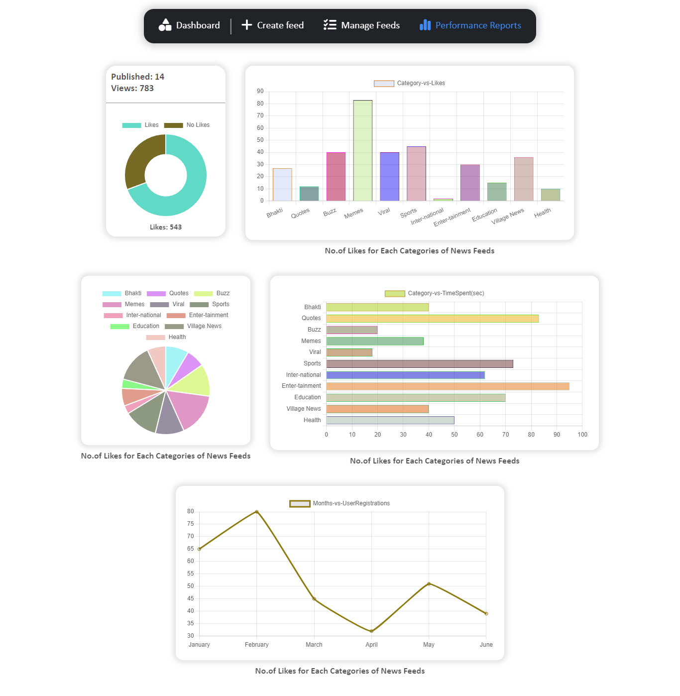

# Admin Panel For News2Day (Daily news app) - [Live Link](https://news2day-frontend-assignment.vercel.app/)

### [Demo Video Link](https://www.youtube.com/watch?v=epSGZ8JQA2Y)

## Steps to Run Locally

1. Fork or directly download the ZIP file.
2. Extract the ZIP file.
3. Run the following commands on root folder of project.
   - `npm install`
   - `npm run dev`
4. Open `localport:1573` on your browser.

## Tech Stack Used

- **React Framework** with useState, useEffect, etc Hooks
- **Recoil-JS** for Global State Management
- **Font-Awesome** for icons
- **Chart-JS** for visual charts and graphs.

## Features

- Quick Links, Stats, Top Performed News Feeds on the Dashboard Page.
- Creating a news feed with media(images, videos), title, content and category.
- Drafting, Previewing and Publishing the news.
- News Feeds Table with edit, view and delete Actions.
- Performance Reports of published news feeds with Visual Charts and Graphs.
- Responsive Preview page
- Media Traversion on Preview Page.
  - Touch - for mobile view.
  - Left, Right Buttons for PC view

## Pages

1. Dashboard

2. Create News Feed

3. Manage News Feeds

4. Performance Reports

5. Preview New Feed - PC view

6. Preview News Feed - Mobile View

